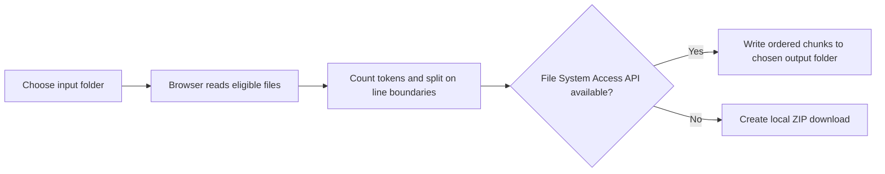

# LMTokenCook

<p align="center">
  
</p>

<p align="center"><strong>Turn a large folder of text and code into smaller, ordered context files an AI conversation can actually receive.</strong></p>

> **Review copy only.** This proposed replacement is on `docs/readme-draft`. It does not change the main README, the live browser app, or LMTokenCook’s official product artwork.

When a project will not fit into one message, the usual choices are bad: paste a partial view, lose file order, or manually split files for hours. LMTokenCook makes that handoff deliberate. It reads the files you choose, counts tokens, creates an optional map, then writes line-aware chunks in order.

**Worth trying if:** you need to give an AI tool a large codebase or document set without losing the structure that makes the files understandable.

<p align="center">
  
</p>

The screenshot is a real browser-interface capture with no selected source files or private project data.

## How the browser workflow stays local



The primary browser app uses browser folder permissions and local ZIP generation; selected folders are not uploaded as part of that workflow. The output is still a copy of your source material, so review it before sharing with any AI service.

## Use it now

- **Browser app:** https://lmtokencook.dropshockdigital.com/
- **Source:** https://github.com/DropShock-Digital/LMTokenCook

### Run the browser app locally

```bash
git clone https://github.com/DropShock-Digital/LMTokenCook.git
cd LMTokenCook/src/ui
npm ci
npm run dev
```

Open the local URL printed by Vite. Chromium-family browsers provide the full input/output folder path. Other supported browsers use the local ZIP fallback.

### Check a change

```bash
cd src/ui
npm ci
npm run build
```

The Python service is a compatibility and experimental path. Its requirements and tests live under `src/server/` and `tests/`.

## What it does—and does not do

| It helps with | It does not do |
| --- | --- |
| Ordered, line-aware context chunks | Increase an AI model’s context window |
| Token counts and an optional project map | Decide whether source material is safe to share |
| Folder output when supported, ZIP fallback otherwise | Parse every binary or office-file format in the browser path |
| A local-first browser workflow | Guarantee a third-party AI service accepts a chosen token count |

## Keep source material under control

- Select only folders you are allowed to share.
- Review generated chunks before sending them anywhere.
- Do not send credentials, client files, personal data, or regulated material to an AI service without authorization.
- Treat the Python compatibility/API path separately from the local-first browser flow when evaluating privacy and deployment risk.

## Project map

| Path | Role |
| --- | --- |
| `src/ui/` | Browser-native React app |
| `src/ui/src/lib/chunker.ts` | Token counting and line-aware chunking |
| `src/ui/src/lib/fs-handler.ts` | Permissioned folder access and output writing |
| `src/server/` | Python compatibility and API experiment path |
| `tests/` | Python regression tests |
| `assets/` | Official product artwork and diagrams |

## Contributing, security, and license

Read [CONTRIBUTING.md](CONTRIBUTING.md) before opening a change. For a security issue, use GitHub’s private vulnerability-reporting option; do not post source material, credentials, generated chunks, or proof data in a public issue. See [SECURITY.md](SECURITY.md).

LMTokenCook is available under the [MIT License](LICENSE).

Built by [DropShock Digital](https://dropshockdigital.com) and Steven Seagondollar.
