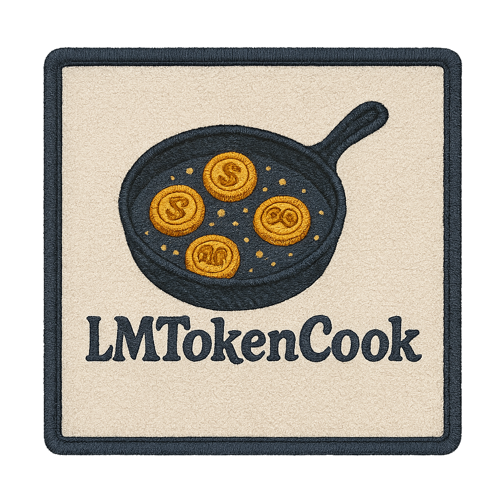
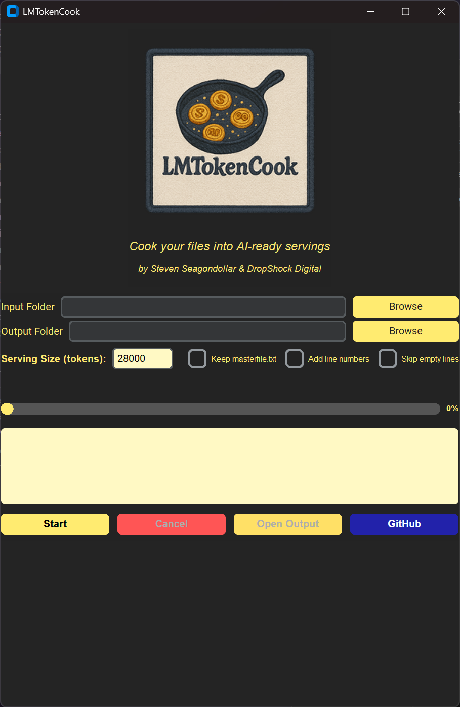
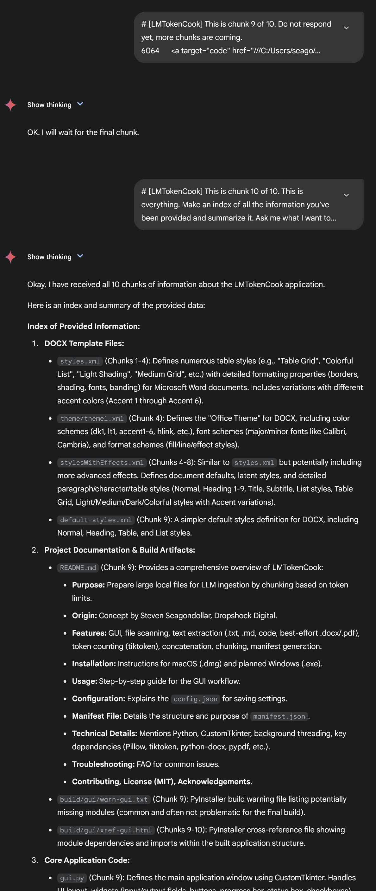

<h1 align="center">Cook your files into AI-ready servings</h1>

## 🚀 Download

- [Download for Windows (.exe)](https://github.com/seagpt/LMTokenCook/releases/latest/download/LMTokenCook.exe)
- [Download for macOS (.dmg)](https://github.com/seagpt/LMTokenCook/releases/latest/download/LMTokenCook.dmg)

### Overview 🍳

LMTokenCook is an AI power-user’s favorite tool to maximize their value with web interface–based, large-context-window language models. The tool compiles your data into a single master text file that begins with a map of the file hierarchy, appends each file’s content (labeled with its full path and token count), and offers to divide your consolidated content into manageable servings based on the token limit you set.

Powerful AI models like Gemini offer a 1,000,000-token context window for API users, but web interface subscribers can only submit ~70,000 tokens per prompt. This can make it difficult to provide full context to Gemini if you're working with a book, transcript, or code repository that exceeds the prompt limit. However, thanks to LMTokenCook, you can sequentially copy and paste each serving into your chosen AI tool based on its limits—saturating the full 1,000,000-token context window and ensuring you get the most out of your subscriptions.

The primary output is optimized, clean plain text (`.txt`) files, ensuring maximum compatibility and efficient token usage.

---

### Features ✨

* **Cross-Platform GUI:** Modern, easy-to-use interface built with CustomTkinter, available for macOS and Windows. 💻
* **Flexible Input:** Select input directories using a familiar file browser or use convenient drag-and-drop. 📁
* **Configurable Output:** Choose a base directory; LMTokenCook creates a unique, timestamped subfolder for each run's results. 💾
* **Selective File Processing:** Recursively scans directories, processing files based on an extensible list of text/code/document extensions (e.g., `.txt`, `.md`, `.py`, `.js`, `.css`, `.java`, `.docx`, `.pdf`, `.ipynb`). Automatically skips binary files, symbolic links, and common exclusion folders like `.venv`. 🧐
* **Robust Text Extraction:** Extracts text from various formats:
    * Plain Text & Code (numerous extensions supported).
    * Microsoft Word (`.docx`) via `python-docx` (best-effort).
    * PDF (`.pdf`) via `pypdf` (best-effort, requires text layer).
* **Accurate Tokenization:** Uses OpenAI's `tiktoken` library (`cl100k_base` encoding) for reliable token counting, closely matching models like GPT-4 and Gemini. 🪙
* **Optimized Concatenation:** Efficiently combines text from processed files into a single stream, adding clear file path markers (`=== File Start/End ===`).
* **Optional Master File:** Keep the full concatenated `masterfile.txt` (named with total token count) or discard it after serving to save disk space.
* **Intelligent Token-Based Servings:** If total tokens exceed your limit, automatically splits the content into sequentially named `serving_XXX_of_YYY.txt` files. Includes instructional comments in each serving to guide sequential pasting into the LLM. 🔢
* **Line Numbering Option:** Optionally prepend `NNNN ` to each line for easy referencing within the LLM context. #️⃣
* **Skip Empty Lines Option:** Optionally remove blank lines to condense content and potentially save tokens. 🧹
* **Detailed Manifest:** Generates a `manifest.json` for every run, providing full transparency on processed/skipped/errored files, run metadata, character offsets, and token counts. 🧾
* **Responsive UI:** Background threading ensures the interface remains usable even during large processing tasks, with real-time progress updates. ⏳
* **Configuration Saving:** Remembers your last output folder and serving size via `config.json` (using `appdirs`). ⚙️

---

## 🖼️ Example: Gemini Workflow with Servings

*Above: Example of sequentially pasting LMTokenCook servings into Gemini for full-context AI work.*

---

### ⭐ Understanding LLMs, Tokens, and Windows

To get the most out of LMTokenCook, it helps to understand a few concepts about how Large Language Models work:

* **What are LLMs?** Models like **Google Gemini**, **OpenAI's ChatGPT (GPT-4 family)**, **Anthropic's Claude**, **Mistral AI's models**, and **Meta's LLaMA** are trained on vast amounts of text data to understand and generate human-like language. They power chatbots, content creation tools, code assistants, and much more.

---

## 🛠️ Contributions

- **Garrett** – Provided critical technical assistance with the following:
  - Diagnosed and solved `tiktoken` dependency issues that prevented successful packaging and execution of LMTokenCook on both Windows and macOS.
  - Improved cross-platform packaging reliability for the EXE and DMG builds.
  - Offered technical troubleshooting and feedback that led to a smoother user experience and more robust application distribution.

---

## 📚 Supporting Knowledge

* **What are Tokens? 🪙** LLMs don't see words like we do. They break text down into smaller pieces called **tokens**. A token might be a whole word ("apple"), part of a word ("un", "happi", "ness"), a punctuation mark (","), or even just a space. The process is called **tokenization**.
    * **Why Tokens Matter:** Models have limits based on *tokens*, not words or characters. API usage is often billed per token. Efficient token usage saves cost and processing time. Different languages tokenize differently (e.g., some languages use more tokens per word than English).
    * **How it Works:** Common methods like Byte Pair Encoding (BPE), WordPiece (used by BERT), or SentencePiece build a vocabulary of tokens. LMTokenCook uses `tiktoken` (specifically `cl100k_base`), which is used by many modern models, ensuring its serving sizes are relevant.

* **What is a Context Window? 🧠** This is the model's "memory" – the maximum number of tokens it can consider *at once* when processing your input and generating a response. This includes your prompt, any previous conversation history sent back to the model, and sometimes the generated output itself.
    * **Importance:** A larger context window allows the model to "remember" more information from earlier in a conversation or a long document, leading to more coherent and contextually relevant responses.
    * **Trade-offs:** Larger context windows require significantly more computational power and memory, potentially leading to slower responses and higher costs.

* **What is a Prompt/Input Limit? ✍️** This is often *different* and *smaller* than the total Context Window. It's the practical limit on how many tokens you can actually *send* to the model in a single turn via its web interface or API call.
    * **Why Limits Exist:** Web interfaces often have smaller prompt limits than APIs to ensure a responsive user experience and manage server load. Even APIs usually limit the input size per request, even if the underlying model *could* handle more context overall.
    * **Relevance to LMTokenCook:** The **Serving Size** you set in LMTokenCook should be based on the **Prompt/Input Limit** of the specific interface or API you are using, *not* necessarily the model's maximum Context Window. Leave headroom! (e.g., set serving size to 28k for a 32k prompt limit). LMTokenCook helps work around these prompt limits by breaking your large context into manageable servings.

* **Major Models & Approximate Limits (Early 2025 - *Always check official docs for current values!*):** 📊

    | Model (Provider)                   | Max Context Window         | Typical Prompt/Input Limit & Details                                                                                                | Max Output Limit         | Web Interface Access                                                                      |
    | :--------------------------------- | :------------------------- | :---------------------------------------------------------------------------------------------------------------------------------- | :----------------------- | :---------------------------------------------------------------------------------------- |
    | ChatGPT (GPT-4.1 by OpenAI)      | Up to 1M tokens (API/latest) | Web: ~32k–128k tokens (tier-dependent). API: Tiered, e.g., 128k.                                                                      | ~4k tokens (often 4096)  | chat.openai.com                                                                           |
    | Google Gemini (inc. 1.5 Pro)     | Up to 2M tokens (1M public)  | ~65k tokens (Flash models). Higher for Pro via specific interfaces (e.g., Google AI Studio).                                         | ~8k tokens (model-dep.)  | Google AI Studio, Vertex AI                                                               |
    | Anthropic Claude (e.g., 3.5 Sonnet) | 200k+ tokens (model/tier dep.) | Web usage often lower than max. Enterprise/API tiers allow larger inputs, often below full context window for practical use.      | ~4k-8k tokens            | claude.ai                                                                                 |
    | Mistral NeMo (by Mistral AI)     | 128k tokens                | Interfaces often limit prompts (~8k-32k) due to integration, though model supports up to 128k via API.                               | ~4k tokens               | Third-party (Hugging Face, API, etc.)                                                     |
    | Meta LLaMA (e.g., LLaMA 3.2)       | 128k tokens                | No official web UI. Limits depend heavily on hosting implementation & resources (community platforms, self-hosted).                 | Implementation-dependent | Community interfaces (Hugging Face, etc.)                                                 |

---

### ❗ Mandatory Reading: Understand Before Use

* **Set Serving Size Wisely:** Base your "Serving Size" setting on the **Prompt/Input Limit** of the specific LLM interface you're using (see table above), *not* the maximum context window. Leave plenty of room (e.g., set `28000` for ChatGPT's 32k limit) for your actual questions and the AI's response within the overall context.
* **Extraction Quality:** Text extraction from PDF and DOCX is complex and may not capture all content perfectly, especially with unusual formatting or image-based documents. Always review the output and check the `manifest.json` for errors.
* **Token Estimates:** Token counts are estimates via `tiktoken`. Actual tokenization by the target LLM might vary slightly. Servings prioritize keeping lines intact, so a serving might slightly exceed the limit if a single line is very long.
* **Privacy:** LMTokenCook processes files locally. However, the output servings are intended for pasting into potentially cloud-based LLMs. Be mindful of the sensitivity of your data before processing and uploading it.

---

### Installation 🚀

* **Prerequisites:**
    * **Operating System:** Windows 10/11 or macOS (>= 11 Big Sur recommended).
    * **Disk Space:** Enough free space for the output subdirectory, which can grow as large as the total extracted text.
* **Steps:**
    1.  **Download:** Go to the [**Releases Page**](link/to/releases) *(<- Replace with actual link)* on GitHub. Download the package for your OS:
        * 🍎 **macOS:** `LMTokenCook_vX.Y.Z.dmg`
        * 🪟 **Windows:** `LMTokenCook_Setup_vX.Y.Z.exe` *(Planned)*
    2.  **Install:**
        * **macOS:** Open the `.dmg`. Drag `LMTokenCook.app` to your Applications folder. On first launch, you may need to bypass Gatekeeper: Right-click the app icon -> select "Open", then confirm in the dialog box.
        * **Windows:** Run the `.exe` installer and follow the prompts. You might need to bypass Windows SmartScreen: Click "More info", then "Run anyway".
    3.  **Launch:** Find LMTokenCook in Applications (macOS) or Start Menu/Desktop (Windows).

---

### Usage Guide 📖

1.  **Launch LMTokenCook:** You'll see the logo and motto.
2.  **Select Input:** Click "Browse..." for "Input Folder" or drag-and-drop your target folder onto the entry field.
3.  **Select Output Location:** Click "Browse..." for "Output Folder" to pick a *base* directory. A new timestamped subdirectory for this run's results will be created inside it.
4.  **Configure Serving Size:** Enter your desired *maximum* tokens per serving (refer to the limits). Leave blank/0 for no serving (outputs only `masterfile.txt`).
5.  **Set Options:** Use the checkboxes:
    * `Keep masterfile.txt`: Saves the full concatenated text alongside servings.
    * `Add line numbers`: Prepends `NNNN ` to each line.
    * `Skip empty lines`: Removes blank lines.
6.  **Start Processing:** Click "Start Processing".
7.  **Monitor:** Watch the Status Log for detailed progress (scanning, file processing, token counts, serving) and the Progress Bar for overall status. Use "Cancel" if needed.
8.  **Completion:** Wait for "[SUCCESS] Processing complete." in the log. Buttons will reset.
9.  **Access Results:** Click "Open Output Folder" to view the results in the new subdirectory (contains `manifest.json` and your `.txt` file(s)).
10. **Feed to LLM:** Copy content from `masterfile.txt` or sequentially from `serving_1_of_N.txt`, `serving_2_of_N.txt`, etc., into your LLM prompts. Use the instructional comments at the start/end of servings to guide the LLM.

    *Example Workflow for Multi-Servings Input:*
    1.  Paste serving 1: "Here is the first part of the context: [Paste content of serving_1_of_N.txt]" -> Send.
    2.  Paste serving 2: "Here is the next part: [Paste content of serving_2_of_N.txt]" -> Send.
    3.  ...continue until the last serving...
    4.  Paste final serving & question: "[Paste content of serving_N_of_N.txt] Now, based on all the context provided, please answer the following: [Your question]" -> Send.

    
*Above: Gemini successfully receiving and processing multiple LMTokenCook serving files in sequence.*

---

### Configuration ⚙️

LMTokenCook automatically saves your last-used settings for convenience:

* **File:** `config.json`
* **Location:** Your system's standard user application configuration directory (found via `appdirs`).
    * *Example macOS:* `~/Library/Application Support/LMTokenCook/config.json`
    * *Example Windows:* `%APPDATA%\LMTokenCook\LMTokenCook\config.json`
* **Settings Saved:**
    * `last_output_dir`: The path to the *base* output folder you last selected.
    * `last_serving_size`: The value last entered for token serving size.
* **Reset:** If needed, simply delete `config.json`; the app will recreate defaults on next launch.

---

### Manifest File (`manifest.json`) 📜

Each run generates a `manifest.json` in the output folder, providing a detailed record:

* **`metadata`:** Summary of the run (paths, timestamp, total file/token counts, serving info, options used).
* **`directory_structure`:** A nested view of the input folder, showing the status (`processed`, `skipped`, `error`) for each item.
* **`processed_files`:** An ordered list detailing each successfully processed file:
    * `relative_path`, `absolute_path`
    * `char_start_offset`, `char_end_offset`: Positions within the *final* concatenated content stream (after filtering/numbering).
    * `char_count`: Character length of the *extracted* text.
    * `estimated_tokens`: Token count estimated by `tiktoken` for the *extracted* text.
    * `extraction_status`: "Success" or specific error details.
    * `encoding_used`: Typically 'utf-8'.

---

### Technical Details 🛠️

* **Architecture:** Python GUI application using **CustomTkinter**. File I/O and processing occur in a background **thread** managed via a **`queue.Queue`** to maintain UI responsiveness.
* **Key Dependencies:** Python 3.8+, `customtkinter`, `Pillow` (for UI assets), `tiktoken` (for tokenization), `tkinterdnd2` (optional, for drag-and-drop), `python-docx` (for .docx extraction), `pypdf` (for .pdf extraction), `appdirs` (for config path). *(See `requirements.txt` for versions).*
* **DOCX Styles:** The application package includes DOCX style definition files (`styles.xml`, `theme1.xml`, etc.). These originate from standards or the `python-docx` library and define formatting for Word documents, but are *not* applied to LMTokenCook's primary plain text output servings.
* **Distribution:** Packaged using **PyInstaller**.

---

### Troubleshooting ❓

*(Same content as previous README, potentially adding a note about checking manifest token counts if filtering/numbering was used)*

1.  **Error: `ModuleNotFoundError: No module named 'customtkinter'` (or similar)?**
    * *Cause:* Likely running from source without installing dependencies or activating the virtual environment. This should not happen with the packaged application.
    * *Solution:* If running from source, ensure your virtual environment is active and you've run `pip install -r requirements.txt`. If using the packaged version, the installation might be corrupted; try reinstalling.
2.  **Application is Unresponsive ("Not Responding") During Processing?**
    * *Cause:* Although designed to be responsive, extremely intense I/O or a bug in background processing could potentially cause temporary freezes.
    * *Solution:* Wait a short while. If it persists, you may need to force quit. Check the terminal log (if launched from console) for errors. Report the issue with details about your input data and system specs via GitHub Issues.
3.  **PDF or DOCX File Skipped / Text Missing / Error in Log?**
    * *Cause:* File might be password-protected, image-based (scan), corrupted, or use features the extraction library doesn't support.
    * *Solution:* Check the `manifest.json` and GUI/terminal logs for specific error messages related to that file. Try opening the file normally. Extraction is best-effort for these types.
4.  **Token Count / Servingsing Seems Off?**
    * *Cause:* Token counts are estimates (`tiktoken`). Different models might tokenize slightly differently. Servingsing aims for the *limit* but might slightly exceed it if a single line/word pushes it over. Filtering/line numbering options *will* change the final token count compared to raw extraction.
    * *Solution:* This is generally expected behavior. The goal is to create manageable servings close to the limit. Ensure your serving size setting allows reasonable headroom for your target LLM. Check the `manifest.json` for token counts *after* processing options were applied if needed.
5.  **How to Reset Saved Settings?**
    * *Solution:* Find the `config.json` file (see Configuration section for location) and delete it. The application will create a new one with defaults on the next launch.
6.  **Drag-and-Drop Doesn't Work?**
    * *Cause:* The underlying `tkinterdnd2` library might have installation issues or platform incompatibilities, especially when running from source.
    * *Solution:* Use the "Browse..." button as the primary method for selecting files/folders. If building from source, ensure `tkinterdnd2` is correctly installed for your platform.

---

### License 📄

Copyright (c) 2025 Steven Seagondollar, DropShock Digital

This project is licensed under the terms of the **MIT License**. See the `LICENSE.md` file for the full text.

---

### Acknowledgements 🙏

LMTokenCook stands on the shoulders of giants! This application is built with Python and leverages several fantastic open-source libraries that make its functionality possible. We extend our sincere gratitude to the developers and communities behind these projects:

* **Core Language:** [Python](https://www.python.org/)
* **GUI Framework:** [CustomTkinter](https://github.com/TomSchimansky/CustomTkinter)
* **Tokenization:** [tiktoken](https://github.com/openai/tiktoken) by OpenAI
* **PDF Extraction:** [pypdf](https://github.com/py-pdf/pypdf)
* **DOCX Extraction:** [python-docx](https://github.com/python-openxml/python-docx)
* **Configuration Directory Handling:** [appdirs](https://github.com/ActiveState/appdirs)
* **Drag-and-Drop (Optional):** [tkinterdnd2](https://github.com/python-tkdnd/tkdnd/)
* **Image Handling:** [Pillow](https://python-pillow.org/)
* **Packaging:** [PyInstaller](https://pyinstaller.org/)