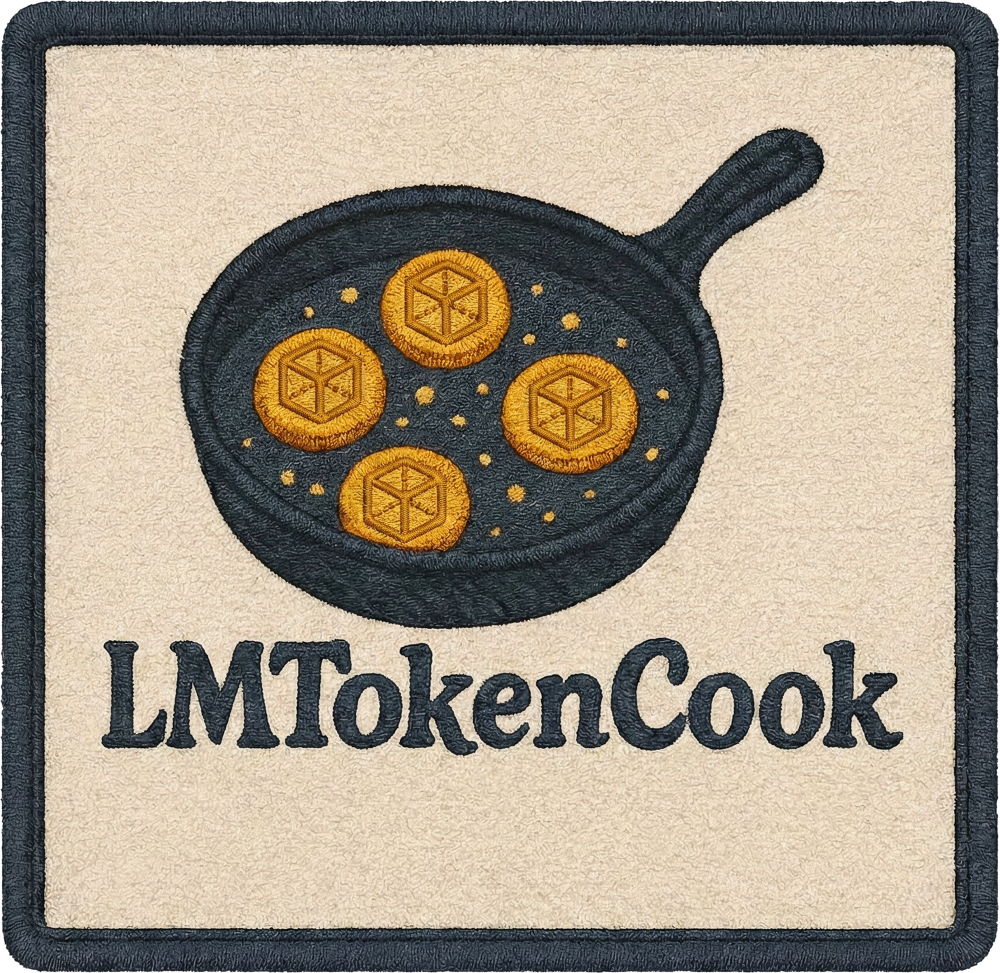
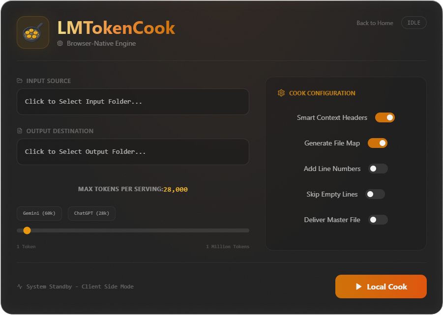

<p align="center">
  
</p>

<h1 align="center">LMTokenCook</h1>

<p align="center"><strong>Turn large folders of text and code into clean, token-sized context for AI tools.</strong></p>

<p align="center">
  <a href="https://github.com/DropShock-Digital/LMTokenCook/actions/workflows/ci.yml"></a>
  <a href="LICENSE"></a>
  
  
</p>

LMTokenCook reads a project or document folder, counts tokens, builds a file map, and writes manageable text chunks that are easier to feed into conversational AI tools in order.

**Try the browser app:** <https://lmtokencook.dropshockdigital.com>



## Why it exists

Copying a large project into an AI chat is unreliable: uploads may be rejected, content can be split in the wrong places, and the model may answer before receiving the full context. LMTokenCook makes that handoff predictable without pretending to expand a model's actual context window.

## What it does

- Reads nested folders of text and source files.
- Skips common build output, hidden folders, and binary image/executable files.
- Counts tokens with `cl100k_base` tokenization.
- Splits content on line boundaries at a configurable token limit.
- Generates an optional project structure and token map.
- Adds optional ordered context headers so a chat can wait for all parts.
- Writes directly to an output folder in supported browsers or downloads a ZIP fallback.

## Privacy model

The primary React workflow processes selected files **inside your browser**. The chosen folder is not uploaded by that workflow. Your browser still needs explicit permission to read the input and, where supported, write the output.

Treat generated chunks as copies of the source material: review them before sharing, and do not send private code, credentials, client data, or regulated information to an AI service unless that use is authorized.

## Run locally

```bash
git clone https://github.com/DropShock-Digital/LMTokenCook.git
cd LMTokenCook/src/ui
npm ci
npm run dev
```

Open the local URL printed by Vite. Chromium-family browsers provide the fullest folder read/write experience; other browsers use the ZIP download fallback.

## Verify a change

### Frontend

```bash
cd src/ui
npm ci
npm run build
```

### Python compatibility path

```bash
python -m venv .venv
source .venv/bin/activate
pip install -r src/server/requirements.txt
PYTHONPATH=. python -m pytest tests/
```

The Python server is retained for compatibility and experiments; the browser-native React workflow is the primary product path.

## Repository map

| Path | Purpose |
| --- | --- |
| `src/ui/` | Browser-native React application |
| `src/ui/src/lib/chunker.ts` | Token counting and line-aware chunking |
| `src/ui/src/lib/fs-handler.ts` | Permissioned local folder access |
| `src/server/` | Optional Python compatibility/API path |
| `tests/` | Python regression tests |
| `assets/` | Brand and architecture artwork |

## Limitations

- LMTokenCook does not increase an AI model's context window.
- Token presets for third-party products are estimates and may change.
- Binary formats such as images, executables, and arbitrary office documents are not parsed by the browser workflow.
- You are responsible for reviewing output order, completeness, confidentiality, and suitability for the target model.

## Contributing

See [CONTRIBUTING.md](CONTRIBUTING.md). Please report security concerns through [SECURITY.md](SECURITY.md), not in a public issue.

## License

LMTokenCook is available under the [MIT License](LICENSE).

Built by [DropShock Digital](https://dropshockdigital.com) and Steven Seagondollar.
