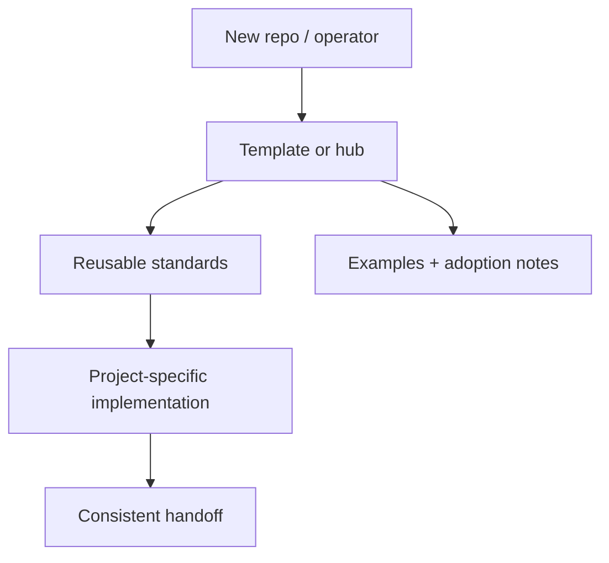
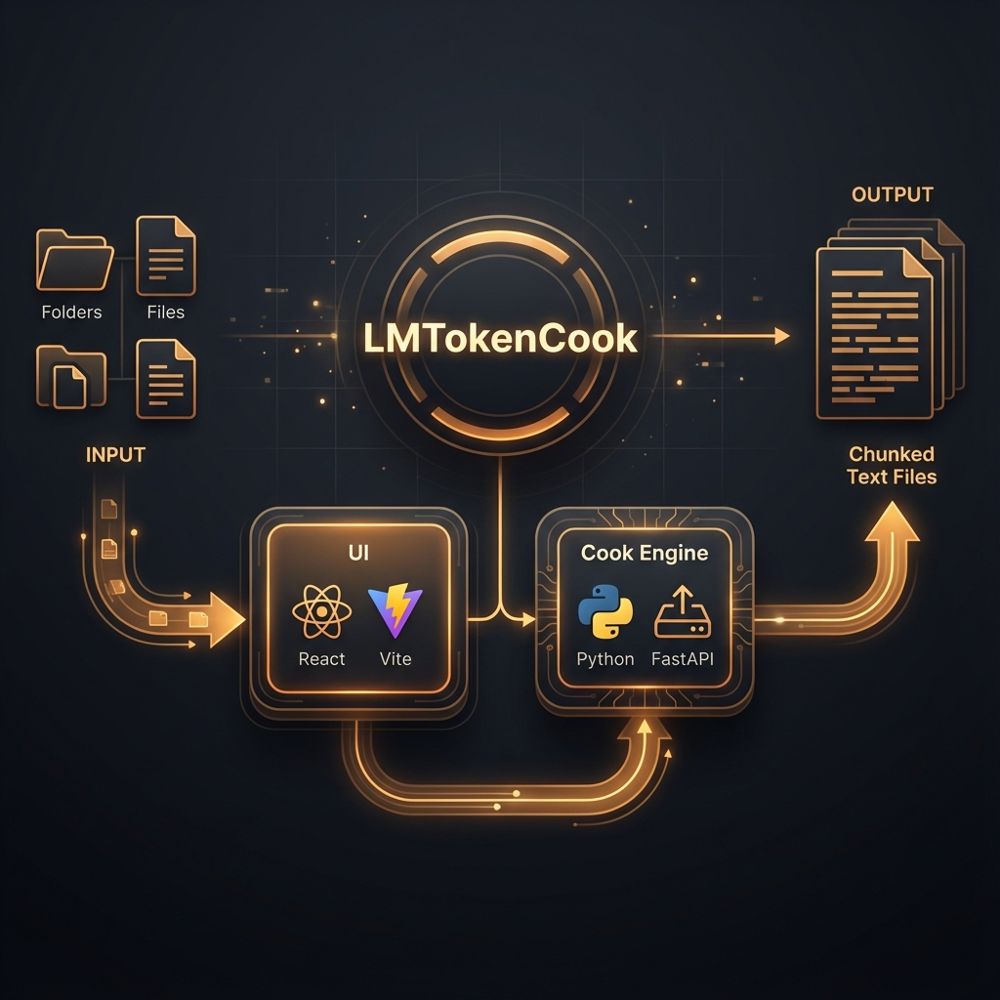

# LMTokenCook

   

Parse Your Files to Bypass Prompt Window Limits.

Built and maintained by **DropShock Digital**.

---

## First screen

| Area | Detail |
| --- | --- |
| Repository | [`DropShock-Digital/LMTokenCook`](https://github.com/DropShock-Digital/LMTokenCook) |
| Primary class | profile / organization hub |
| Current posture | prototype |
| Default branch | `main` |
| Visibility | public |
| Last README standardization | 2026-06-26 |

## What matters

- Make the repo purpose obvious in the first 30 seconds.
- Put the architecture or workflow in a visual map before deep prose.
- Keep commands, environment notes, and handoff risks close to the top.
- Credit the real builder/maintainer while keeping client or project context separate from implementation notes.
- Audit priority: `P2`

## System map


```mermaid
flowchart TD
    A["New repo / operator"] --> B["Template or hub"]
    B --> C["Reusable standards"]
    C --> D["Project-specific implementation"]
    D --> E["Consistent handoff"]
    B --> F["Examples + adoption notes"]
```


### Visual proof




## Best features carried forward

- Visual-first GitHub Markdown is kept, but constrained to one clear hero/asset lane.
- Existing Mermaid thinking is preserved and moved near the top as the system map.
- Existing setup intent is kept and reframed as a short operator path.
- Architecture language is retained but converted into a skimmable diagram-first explanation.
- Icon-rich scanning is retained where it helps readers move faster.

## Operate this repo

**Detected stack:** Python project metadata, Dockerfile, Docker Compose

```bash
python -m venv .venv
source .venv/bin/activate
pip install -r requirements.txt
docker build -t local-app .
docker compose up --build
```

> Commands above are inferred from repository files and should be verified before they become release or client handoff instructions.

## Documentation map

- [`LICENSE`](LICENSE)
- [`docker-compose.yml`](docker-compose.yml)

## Handoff notes

| Area | Detail |
| --- | --- |
| Secrets | No `.env.example` was detected; add one before documenting environment-specific setup. |
| License | License file detected. |
| Owner credit | Built and maintained by DropShock Digital. |
| Next documentation move | Add `docs/ARCHITECTURE.md` with the full system diagram and decisions. |

## Maintenance standard

This README follows the DropShock repo documentation format: one clear identity, one visual map, a short operator path, explicit ownership, and deeper detail moved into linked docs when needed. If the repo grows, add or update `docs/ARCHITECTURE.md`, `docs/DEPLOYMENT.md`, and `docs/OPERATIONS.md` instead of turning the README into a wall of text.
